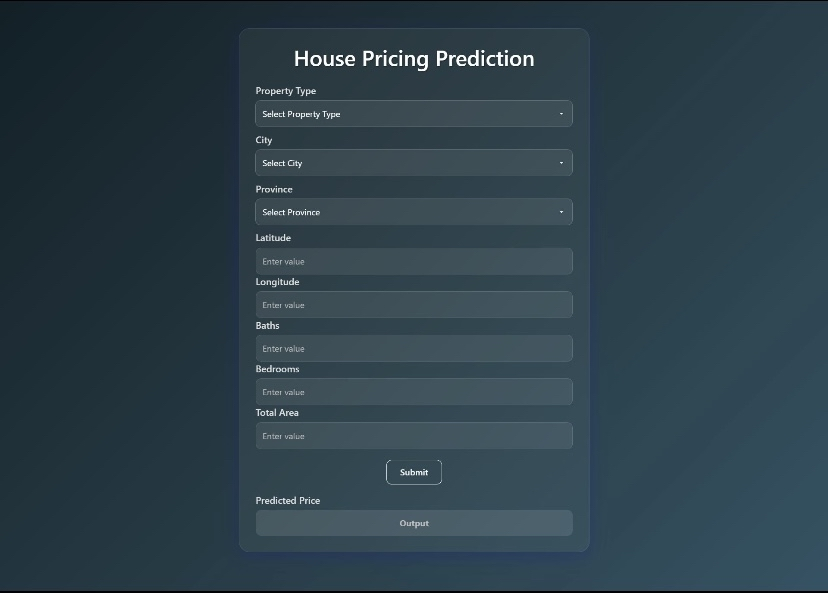
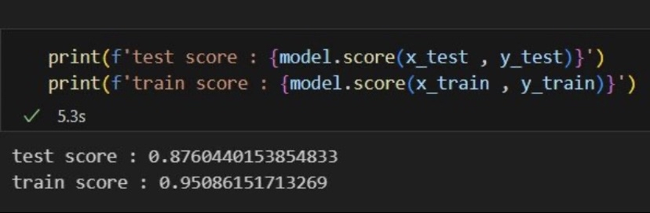
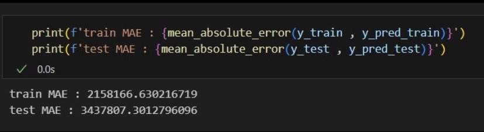
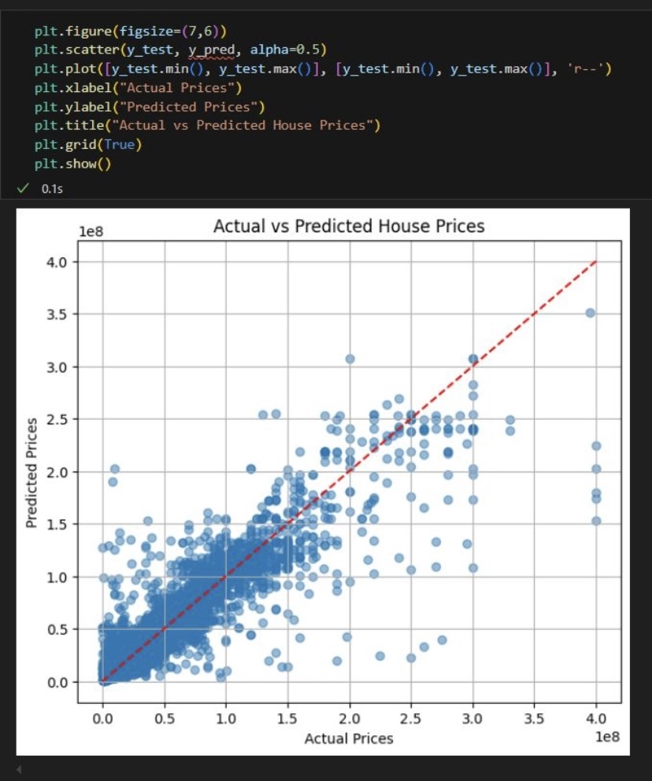

# 🏡 House Price Prediction Using Machine Learning

A **regression-based machine learning project** that predicts **house prices** using real-world property features.  
The model is built with a **Random Forest Regressor** and follows a complete data science pipeline from preprocessing to evaluation.

---

## 🎯 Features

- 🌲 **Random Forest Regressor** for price prediction  
- 🧹 Complete data preprocessing pipeline:
  - Dropping unnecessary columns  
  - Outlier removal  
  - Feature engineering  
  - Label & One-Hot Encoding  
  - Feature scaling  
- 📊 Model evaluation using:
  - R² Score  
  - MAE (Mean Absolute Error)  
  - RMSE  
- 🖥️ Clean frontend interface for user input & prediction  

---

## 🖼️ Visuals

### Frontend View
📸 User interface to enter property features and get predicted house prices  

### Model Score (R²)
📸 Training and Testing **R² score** printed using `model.score()`  

### Error Metrics (MAE)
📸 Training and Testing **Mean Absolute Error (MAE)** evaluation  

### Residual / Prediction vs Actual Plot
📸 Visual validation of model performance and generalization  

---

## 📊 Model Evaluation

- **Metrics Used:**
  - R² Score  
  - Mean Absolute Error (MAE)  
  - Root Mean Squared Error (RMSE)  
- Residual analysis used to assess **prediction spread and bias**

---

## 🧠 Tech Stack

- **Language:** Python  
- **Machine Learning:** Scikit-learn  
- **Model:** Random Forest Regressor  
- **Data Processing:** Pandas, NumPy  
- **Visualization:** Matplotlib, Seaborn  
- **Frontend:** HTML, CSS  

---

## 📚 Learning Outcomes

- Strong understanding of **regression modeling**  
- Hands-on experience with **feature preprocessing & engineering**  
- Learned how to evaluate models using **multiple regression metrics**  
- Improved ability to analyze **model generalization using residual plots**  
- Applied ML techniques to **real-world housing data**

---

## 🚀 About

This project strengthened my skills in **machine learning regression, data preprocessing, and model evaluation**, and motivated me to build more impactful real-world ML applications.

